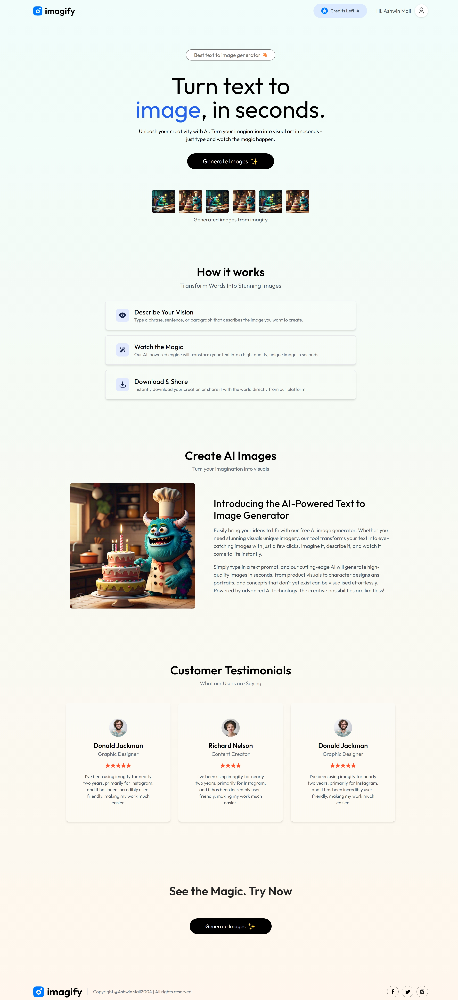
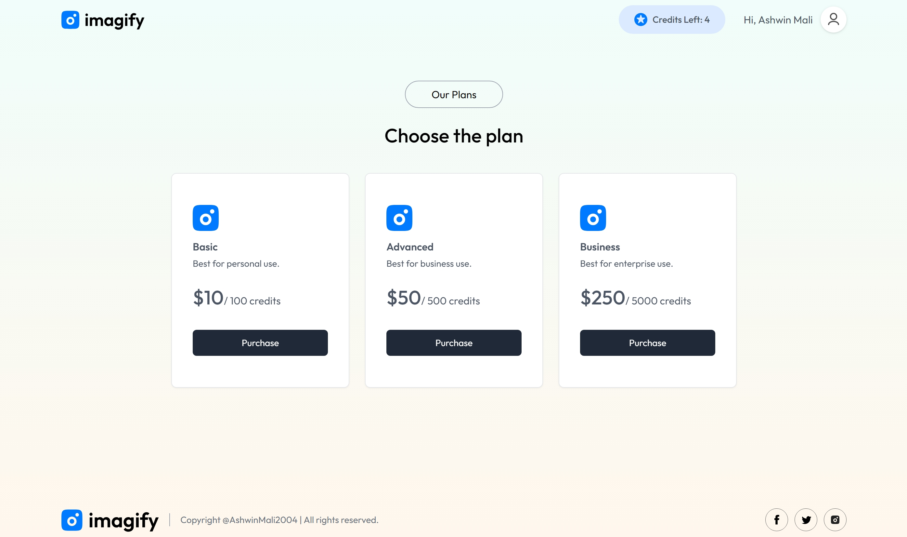
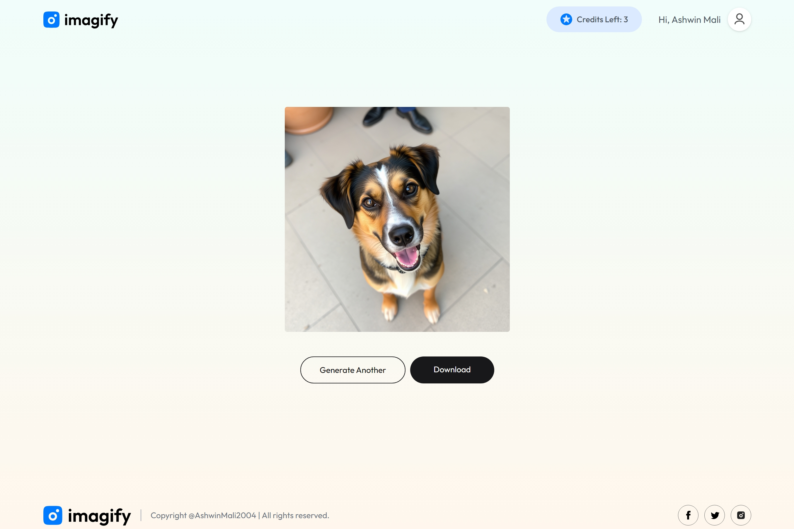

# MERN Text-to-Image AI App

This is a full-stack AI-powered text-to-image generation application built using the MERN stack. The app utilizes ClipDrop's AI API to generate images from text prompts and stores user-generated images in a MongoDB database. The front end is designed with React and Tailwind CSS for a modern UI.

## Features
- Convert text prompts into images using ClipDrop API
- User authentication and image history storage with MongoDB
- Responsive and modern UI with Tailwind CSS
- Backend built with Express and Node.js
- RESTful API for handling requests
- **Integrated Stripe payment gateway for premium features**

## Tech Stack
- **Frontend:** React, Tailwind CSS
- **Backend:** Node.js, Express.js
- **Database:** MongoDB
- **AI Model:** ClipDrop API
- **Payment Gateway:** Stripe

## Clips-->
- **DashBoard**

- **BuyCredits**

- **ResultPage**



## Installation & Setup

1. Clone the repository:
   ```sh
   git clone https://github.com/ashwinmali2004/mern-text-to-image-ai.git
   cd mern-text-to-image-ai
   ```

2. Install dependencies for both frontend and backend:
   ```sh
   # Backend
   cd backend
   npm install

   # Frontend
   cd ../frontend
   npm install
   ```

3. Create a `.env` file in the `server` directory and add the following:
   ```env
   PORT=5000
   MONGO_URI=your_mongodb_connection_string
   CLIPDROP_API_KEY=your_clipdrop_api_key
   STRIPE_SECRET_KEY=your_stripe_secret_key
   ```

4. Start the backend server:
   ```sh
   cd backend
   npm run server
   ```

5. Start the frontend React app:
   ```sh
   cd frontend
   npm run dev
   ```

## Usage
- Enter a text prompt and generate AI-generated images.
- Save generated images to MongoDB.
- View previously generated images in your history.
- **Purchase premium credits using Stripe for unlimited access.**

## Contributions
Contributions are welcome! Feel free to fork this repository and submit pull requests.
